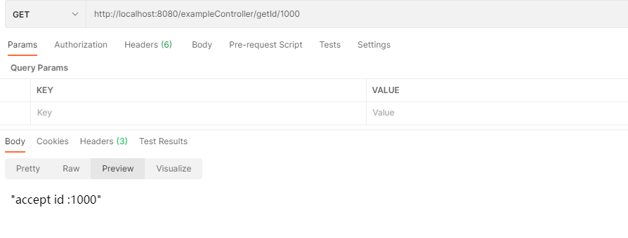
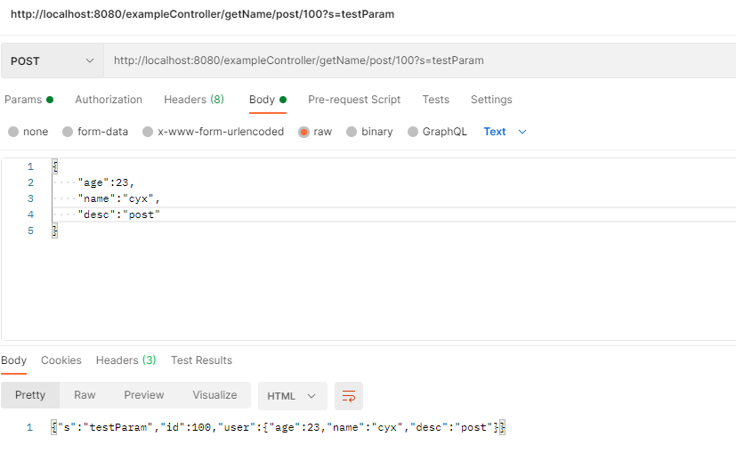
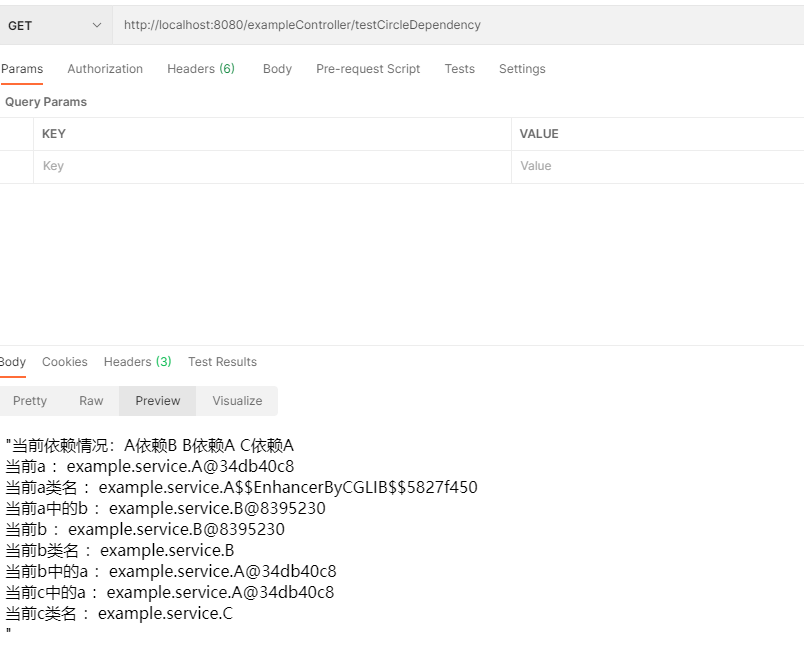

## 描述
1. 由 Netty 实现的 HTTP 服务器，支持各种HTTP方法的处理，只返回 json 数据给前端。
2. 支持 Spring MVC 常用的注解
3. 实现了IOC，并借鉴 Spring 的思想使用三级缓存解决循环依赖。
## Controller 代码
```java
@Slf4j
@RestController(value = "/exampleController")
public class exampleController {

    @Autowired
    ExampleService exampleService;

    @GetMapping(value = "/testCircleDependency")
    public Object testCircleDependency() {
        StringBuilder result = new StringBuilder();
        result.append("当前依赖情况：A依赖B B依赖A C依赖A <br/>");
        A a = (A)BeansFactory.SINGLETONS.get("example.service.A");
        B b = (B)BeansFactory.SINGLETONS.get("example.service.B");
        C c = (C)BeansFactory.SINGLETONS.get("example.service.C");
        result.append("当前a ：").append(a.toString()).append("<br/>");
        result.append("当前a类名 ：").append(a.getClass().getName()).append("<br/>");
        result.append("当前a中的b ：").append(a.getB().toString()).append("<br/>");
        result.append("当前b ：").append(b.toString()).append("<br/>");
        result.append("当前b类名 ：").append(b.getClass().getName()).append("<br/>");
        result.append("当前b中的a ：").append(b.getA().toString()).append("<br/>");
        result.append("当前c中的a ：").append(c.getA().toString()).append("<br/>");
        result.append("当前c类名 ：").append(c.getClass().getName()).append("<br/>");
        return result.toString();
    }


    @GetMapping(value = "/getId/{id}")
    public String getId(@PathVariable int id) {
        return exampleService.test(id);
    }

    @PostMapping(value = "/getName/post/{id}")
    public Map<String, Object> createUser(@RequestBody User user, @RequestParam String s, @PathVariable int id) {
        Map<String,Object> map = new HashMap<>();
        map.put("id",id);
        map.put("user",user);
        map.put("s",s);
        return map;
    }

    @PostMapping(value = "/getName/post")
    public Map<String, Object> post(@RequestBody User user) {
        Map<String,Object> map = new HashMap<>();
        map.put("user",user);
        return map;
    }
}

```
## 功能
**使用@PathVariable传递路径参数**

**使用@RequestBody、@RequestParam、@PathVariable三种注解传递参数**

**解决循环依赖**

`可以看到如果出现循环依赖，是被正确解决，并且注入的对象也都是代理对象`
